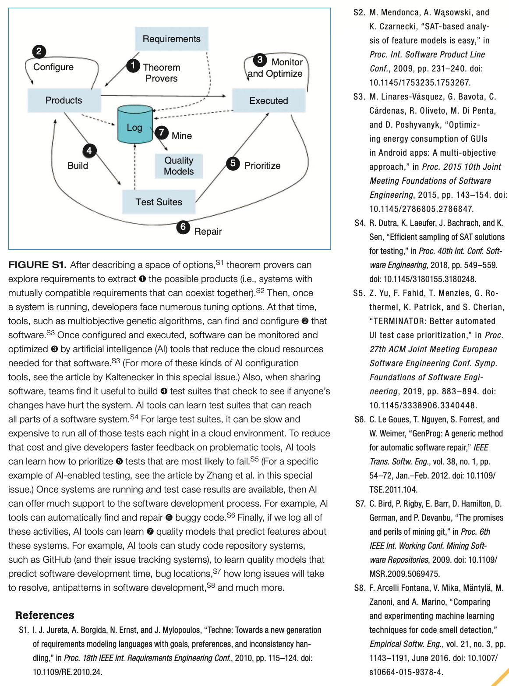

<a name=top>

&nbsp;<a href="https://tiny.cc/seng20">home</a> ::
<a href="https://github.com/txt/se20/blob/master/docs/syllabus.md#top">syllabus</a> ::
<a href="https://github.com/txt/se20/blob/master/docs/syllabus.md#timetable">timetable</a> ::
<a href="https://moodle-courses2021.wolfware.ncsu.edu/course/view.php?id=3873">moodle</a> ::
<a href="http://seng20.slack.com">chat</a>  ::
<a href="https://github.com/txt/se20/blob/master/LICENSE.md#top">&copy; 2020</a>  
 

# Project 1

## How to Pick  a Project

(Hint: do it now!)

Pick something:

- Cool: 
  - Cause you have to impress;
- Ambitious:
  -  Cause you are here to make mistakes
- Not too ambitious:
  - So you cannot make significant progress in 5 weeks;
- Not too small: 
  - So you can  impress people with the work;
- Small enough:
  - So you can finish;
- Where there is something already running:
  - So you get going fast;
- Something the whole team can contribute to
  - Work in  a language that everyone in the team can handle:
  - Work on a problem everyone can understand

If you want to be in the running for "best project" in task3, your system has to do something better then something else.

- Which means your code has to address some problem in some current system
- And do so in a manner that is quantifiable.
- For that kind of assessment, doing something AI related is useful (but don't feel oblidged to go there is you
  have other ideas).

## Deliverable check list

score each 0..4 Sum, divide by number of rows, multiple by 10.

|What | Notes|score 0..4 (0=no, 2=ok, 4=wow!)|
|-----|------|------|
|Distrbuted dev model: | workload is spread over the whole team (one team member is often Xtimes more productive than the others... but nevertheless, here is a track record that everyone is contributing a lot)||
|| Issues reports: there are many||
|| issues are discussed before they are closed||
||  issues are closed||
||  issues: there are many||
|| test cases exist||
|| test cases are routinely executed||
|| test cases:.a large proprotion of the issues related to handling failing cases.||
|| There are pre-commit tools  (style checkers, formatters, syntax checkers) ||
||Docs: what: point descriptions of each class/function (in isolation) ||
||Docs: how: for common use cases X,Y,Z mini-tutorials showing worked examples on how to do X,Y,Z||
||Docs: why: docs tell a story, motivate the whole thing, deliver a punchline that makes you want to rush out and use the thing||
||Docs: 3 minute video, posted to YouTube. That convinces people why they want to work on your code.||
| consensus-oriented model| the files CONTRIBUTING.md and CODEOFCONDUCT.md has have multiple edits by multiple people||
| | the files CONTRIBUTING.md lists coding standards and lots of tips on how to extend the system without screwing things up||
| | multiple people contribute to discussions||
|short release cycles | project members are committing often enough so that everyone can get your work||
| zero internal boundaries | evidence that the whole team is using the same tools: everyone can get to all tools and files||
| | evidence that the whole team is using the same tools (e.g. config files in the repo, updated by lots of different people)||
| | evidence that the whole team is using the same tools (e.g. tutor can ask anyone to share screen, they demonstrate the system running on their computer)||
| | evidence that the members of the team are working across multiple places in the code base||
| low-regressions rule | (hard to judge) features released are not subsequently removed||

